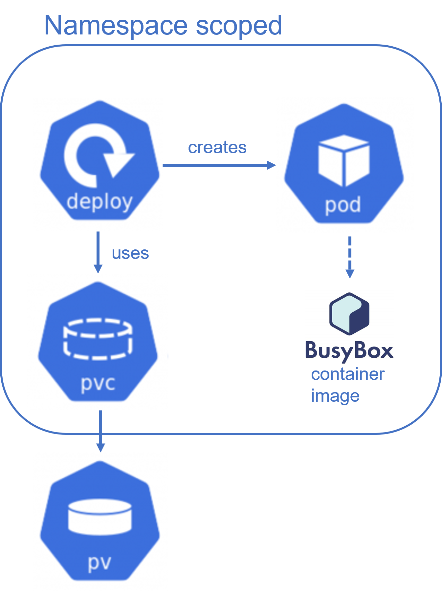

<!--
SPDX-FileCopyrightText: The RamenDR authors
SPDX-License-Identifier: Apache-2.0
-->

# Recipes: An Overview

By default, Kubernetes resources are Captured and Recovered as single, namespaced
groups. Some applications may require strict ordering by type of resource during
Capture or Recover to ensure a successful deployment. To provide this flexibility,
Recipes can be used to describe a Workflow used for a Capture or Recover action.
These Recipe Workflows can be referenced by the VolumeReplicationGroup (VRG), and
executed periodically.

Recipe source code and additional information can be found [here](https://github.com/RamenDR/recipe).
The current Recipe CRD can be found [here](https://github.com/RamenDR/recipe/blob/main/config/crd/bases/ramendr.openshift.io_recipes.yaml).

## Overview of this document

1. What is a Recipe and why do we need it?
1. Recipe concepts
1. Sample application that uses a Recipe
1. Additional details on Recipe functionality
1. Where to go to learn more

## What is a Recipe and why is it needed

* RamenDR concept for more complex application DR needs
* Helps orchestrate capture and recovery sequences of Kubernetes objects
* Merged into Ramen 2/28/2023, commit ID 06e7d4f
* Recipe API managed in a [separate repo](https://github.com/RamenDR/recipe)
* Recipes utilize Velero under the hood
    * Many fields are pass-through to create Velero Backup/Restore objects
* If your application can be backed up and restored without specific sequencing,
  a Recipe may not not be required.

### Background: when is Velero insufficient

Capabilities of Velero:

1. Backup/restore by Namespace, Resource Type, including Cluster-scoped Resources
1. Can run Hooks on an existing Resource or via InitContainer
1. Highly available version exists: OADP
1. ~~Provide Backups/Restores using fully Declarative model~~

Where an application may have issues with Velero:

1. Velero works well when an application can be backed up and restored as a
  single group, but some applications have dependencies that do not allow this
  (e.g. [CP4D](https://www.ibm.com/products/cloud-pak-for-data))
1. Velero supports multiple simultaneous Backups/Restores, but sequences must be
  handled manually, which can be error prone

## How to use a Recipe: Overall flow

1. Understand dependencies of application for capture/recover
1. Create a Recipe that addresses those dependencies
1. Reference Recipe name and contents in VRG
1. Deploy Ramen to protect the application

## Sample Application: Busybox

Note that Busybox does NOT require Recipe support, but is a straightforward way
to demo Recipes.

Overview of application:


There are two main resources to protect with Recipes:

1. Deployment (which creates Pod)
1. PVC (creates and uses PV)

The Pod does not need to be protected since the Deployment creates it.

Sample DR requirements for this application:

1. All resources must be protected together
1. PVCs must be available before Deployments are Recovered

## Recipe API Concepts

There are three high level structs to be aware of: Workflows, Groups, and Hooks.

1. Workflows: Groups and Hooks to run sequentially
1. Groups: what should be included/excluded from a Backup/Restore
1. Hooks: actions to run on Pods at the required place in the Workflow

Note that a Recipe resides in the same Namespace as the Application it protects,
like a VRG. If the Application to protect spans multiple Namespaces, then use
one VRG and one Recipe per Namespace.

## Example Recipe

Full example files of the [VRG](../hack/recipe_e2e/protect/vrg_busybox_primary.yaml)
and [Recipe](../hack/recipe_e2e/protect/recipe_busybox.yaml) linked.

### Basic components

```yaml
apiVersion: ramendr.openshift.io/v1alpha1
kind: Recipe
metadata:
  name: recipe-busybox
  namespace: recipe-test
spec:
  appType: busybox  # required, but currently unused
  hooks:
    # content omitted
  groups:
    # content omitted
  workflows:
    # content omitted
```

### Workflows

Workflows are the high level components desired for DR.
These components are referenced in the VRG.

Workflows have a unique name, and a sequence composed of a Hooks and Groups,
whose details are defined in the Hooks and Groups sections.

There are two Workflows that exist by default: CaptureWorkflow and RecoverWorkflow.

```yaml
kind: Recipe
# metadata omitted for example
# groups, hooks omitted for example
spec:
  captureWorkflow:
    sequence:
    - hook: service-hooks/pre-backup
    - group: instance-resources
  recoverWorkflow:
    sequence:
    - group: pvcs
    - hook: service-hooks/pre-restore
    - group: deployments
```

Note that the sample above matches the Busybox sample requirements, but also adds
Hooks for demonstration purposes.

#### Workflow Sequencing

Given the sample Workflow above:

* The Capture sequence is: Hook -> Group. The Hook must complete before Group begins.
  The Capture sequence is complete when Group finishes successfully.
* The Recover sequence is: Group1 -> Hook -> Group2. Group1 must complete before
  Hook runs, Hook must complete before Group2 begins, and Group2 begins after Hook
  completes. The Recover sequence is complete when Group2 finishes successfully.

#### Sample VRG connection

The sample Recipe in this example is named `recipe-busybox`, and is in the same
Namespace as the VRG shown below. To use this Recipe, the VRG needs to add its
name to the `spec.kubeObjectProtection.recipeRef.name` field.

```yaml
kind: VolumeReplicationGroup
# VRG metadata omitted
spec:
  kubeObjectProtection:
    recipeRef:
      name: recipe-busybox
```

### Groups

#### Resources

Groups define what should be included/excluded from a Backup or Restore.
Since all resources needed can be backed up at the same time, this is defined
in the group `instance-resources`. Since PVCs must be restored before Deployments,
these are broken into two separate groups: `deployments` and `pvcs`, each limiting
the resources to restore to the appropriate type.

```yaml
kind: Recipe
# metadata omitted
spec:
  groups:
    - name: instance-resources
      type: resource
      includedResourceTypes:
      - deployment
      - pvc
    - name: deployments
      backupRef: instance-resources
      type: resource
      includedResourceTypes:
      - deployment
    - name: pvcs
      backupRef: instance-resources
      type: resource
      includedResourceTypes:
      - pvc
# hooks omitted
# workflows omitted
```

#### Volume Groups

When Ramen selects PVCs to protect, a Recipe Group with `type=volume` will be used
for PVC Selection, rather than what is defined on the VRG.

```yaml
kind: Recipe
# metadata omitted
spec:
  volumes:
    name: "volumeGroup"
    type: volume
    labelSelector: appname=busybox
```

### Hooks

Hooks are actions to run on Pods at the required place in the Workflow. Hooks run
on Pod(s) that have been identified via Label Selector. If many Pods run in the
same Namespace but the Hook should only run on a subset of them, filter with LabelSelectors.
If executing a file with Hook (e.g. a shell script), it must exist in Container.

Note: Hooks aren’t needed in Busybox example application. This sample exists to
show the API only.

```yaml
kind: Recipe
# metadata omitted
spec:
  hooks:
  - name: service-hooks
    namespace: recipe-test
    labelSelector: appname=busybox
    type: exec
    ops:
    - name: pre-backup
      container: busybox
      timeout: 600
      # Command note: "/bin/sh -c" required when using non-executable files
      command:
      - "/bin/sh"
      - "-c"
      - "date"
    - name: pre-restore
      container: busybox
      timeout: 400
      command:
      - "/bin/sh"
      - "-c"
      - "date"
# Groups omitted
# Workflows omitted
```

Velero supports Exec and InitContainer Hook styles, but Recipes only use Exec Hooks
right now. It is the responsibility of the user to ensure that the Pod(s) used in
Hooks are available for Backup operations.

#### Restore Hooks: additional information

Restore Hooks do not use Velero Restore objects - they use Backup objects instead.
This was a design choice: Velero Restore Hooks will create a Pod to run a Hook;
if the Pod already exists (meaning Velero can't create the Pod), the Hook will not
run. To guarantee Hooks will run, a Backup object is used instead, but this requires
the user to ensure the existence of the Pod prior to running the Hook.

Q: is this still a problem on Velero 1.9, which allows merge behavior on Restore?
A: Yes. If a Pod exists, the Hook will not run, even if it modifies/edits the existing
  Pod.

## Testing and Verification

Velero objects are created per-Group and per-Hook. The best way to verify this is
by querying the S3 store directly and examining its contents. The Minio Client (`mc`)
is good way to do this: [MC GitHub](https://minio.github.io/mc/)

Ramen will save to deterministic path with S3 store: `MCAliasName/Namespace/VRGName/kube-objects/`

* MCAliasName: alias for MC client, set up by user (the [e2e script](../hack/recipe_e2e/README.md)
  does this for you)
* Namespace: Namespace name where Application is installed
* VRGName: name of the VRG used for Recipe protection

Within kube-objects/, will alternate between two indices: 0 and 1

* Always starts with 1, then goes to 0, repeats

### S3 Overview

The example below shows an application that has captured data in both 0 and 1 indices.
This can be seen in the path `minio-cluster1/velero/recipe-test/bb/kube-objects/INDEX/velero/backups`,
where `INDEX` is either `0` or `1`. Restore objects are present in the `1` index.

Note that this example does NOT use Recipes, which would have created multiple Backup
and Restore objects. Recipes have been omitted for clarity and brevity here.

```bash
mc du -r minio-cluster1

0B      0 objects       bucket
28KiB   9 objects       velero/recipe-test/bb/kube-objects/0/velero/backups/recipe-test--bb--0----minio-cluster1
28KiB   9 objects       velero/recipe-test/bb/kube-objects/0/velero/backups
30KiB   11 objects      velero/recipe-test/bb/kube-objects/0/velero
30KiB   11 objects      velero/recipe-test/bb/kube-objects/0
2.1KiB  2 objects       velero/recipe-test/bb/kube-objects/1/velero/backups/recipe-test--bb--1----minio-cluster1
2.1KiB  2 objects       velero/recipe-test/bb/kube-objects/1/velero/backups
2.1KiB  2 objects       velero/recipe-test/bb/kube-objects/1/velero/restores/recipe-test--bb--0
2.1KiB  2 objects       velero/recipe-test/bb/kube-objects/1/velero/restores
2.1KiB  2 objects       velero/recipe-test/bb/kube-objects/1/velero
2.1KiB  2 objects       velero/recipe-test/bb/kube-objects/1
32KiB   13 objects      velero/recipe-test/bb/kube-objects
1002B   1 object        velero/recipe-test/bb/v1.PersistentVolume
1.1KiB  1 object        velero/recipe-test/bb/v1alpha1.VolumeReplicationGroup
34KiB   15 objects      velero/recipe-test/bb
34KiB   15 objects      velero/recipe-test
34KiB   15 objects      velero
34KiB   15 objects
```

#### S3 Backups

Backups create a `backup.velero.io` object at runtime, but Ramen may delete these
objects after each sequence is completed. If the Kube object is gone, results may
still be obtained by querying the S3 store.

The path to a particular Velero backup uses the following sequence:
`mcAliasName/bucketname/namespaceName/vrgName/kube-objects/index/velero/backups/backupName`

* mcAliasName: set by `mc alias set` and viewable with `mc alias list`
* bucketName: storage bucket in S3. This is configured in the the VRG's s3StoreProfiles.
* namespaceName: namespace used by the VRG and Recipe.
* vrgName: name of the VRG object
* index: either 0 or 1; always starts at 1, and alternates to 0.
* backupName: see below for naming details.

Velero saves contents and results to the S3 store with a predictable sequence:
BackupName=`Namespace--VRGName--Index--GroupName--S3Profile`. Within this path,
the Velero logs, resource list, and other information will be stored. The contents
are generally compressed, except for the `velero-backup.json` file, which we
can use to find the results.

To query the results of a Backup from the S3 store, search for `"phase": "Completed",`
and `"itemsBackedUp":` in the `velero-backup.json` file:

```bash
mc ls minio-cluster1/velero/recipe-test/bb/kube-objects/0/velero/backups/recipe-test--bb--0----minio-cluster1

[2023-04-10 14:42:13 PDT]    29B STANDARD recipe-test--bb--0----minio-cluster1-csi-volumesnapshotclasses.json.gz
[2023-04-10 14:42:13 PDT]    29B STANDARD recipe-test--bb--0----minio-cluster1-csi-volumesnapshotcontents.json.gz
[2023-04-10 14:42:13 PDT]    29B STANDARD recipe-test--bb--0----minio-cluster1-csi-volumesnapshots.json.gz
[2023-04-10 14:42:12 PDT] 4.3KiB STANDARD recipe-test--bb--0----minio-cluster1-logs.gz
[2023-04-10 14:42:13 PDT]    29B STANDARD recipe-test--bb--0----minio-cluster1-podvolumebackups.json.gz
[2023-04-10 14:42:13 PDT]   370B STANDARD recipe-test--bb--0----minio-cluster1-resource-list.json.gz
[2023-04-10 14:42:13 PDT]    29B STANDARD recipe-test--bb--0----minio-cluster1-volumesnapshots.json.gz
[2023-04-10 14:42:13 PDT]  20KiB STANDARD recipe-test--bb--0----minio-cluster1.tar.gz
[2023-04-10 14:42:13 PDT] 2.9KiB STANDARD velero-backup.json

mc cat minio-cluster1/velero/recipe-test/bb/kube-objects/0/velero/backups/recipe-test--bb--0----minio-cluster1/velero-backup.json | grep '"phase":'
    "phase": "Completed",

mc cat minio-cluster1/velero/recipe-test/bb/kube-objects/0/velero/backups/recipe-test--bb--0----minio-cluster1/velero-backup.json | grep "itemsBackedUp"
      "itemsBackedUp": 14
```

#### S3 Restores

Restores create a `restore.velero.io` object at runtime, but Ramen may delete these
objects when creating new Backup sequences. If the Kube object is gone, results may
still be obtained by querying the S3 store. Restore contents follow a similar path,
but the objects are named with a different convention:

RestoreName=`namespace--vrgName--restoreIndex`

* namespace: the name of the namespace used with this VRG and Recipe
* vrgName: the name of the VRG object
* restoreIndex: the index of the restore sequence, starting from 0. In the Busybox
  example above, there would be two entries: `0` and `1`.

Restore results exist in S3, but are compressed files. These can be copied out of
the S3 store and decompressed elsewhere when querying contents. Note that Velero
updates logs multiple times with running progress; the final entry will the total
number of restored objects:

```bash
mc ls minio-cluster1/velero/recipe-test/bb/kube-objects/0/velero/restores/recipe-test--bb--0

[2023-04-06 12:59:25 PDT] 1.9KiB STANDARD restore-recipe-test--bb--0-logs.gz
[2023-04-06 12:59:25 PDT]   232B STANDARD restore-recipe-test--bb--0-results.gz

mc cp minio-cluster1/velero/recipe-test/bb/kube-objects/0/velero/restores/recipe-test--bb--0/restore-recipe-test--bb--0-logs.gz /tmp/restore_logs.gz

...-recipe-test--bb--0-logs.gz:  1.88 KiB / 1.88 KiB ┃▓▓▓▓▓▓▓▓▓▓▓▓▓▓▓▓▓▓▓▓▓▓▓▓▓▓▓▓▓▓▓▓▓▓▓▓▓▓▓▓▓▓▓▓▓▓▓▓▓▓▓▓▓▓▓▓▓▓▓▓▓▓▓▓▓▓▓▓▓▓▓▓▓▓▓▓▓▓▓▓▓▓▓▓▓▓▓▓▓▓▓▓▓▓▓▓▓▓▓▓▓▓▓▓▓▓▓┃ 134.24 KiB/s 0st

gunzip /tmp/restore_logs.gz
gzip: /tmp/restore_logs already exists; do you wish to overwrite (y or n)? y

grep /tmp/restore_logs -e "Restored [0-9]* items" -o | tail -n 1 | awk '{print $2}'
10
```

#### S3 Hooks

As stated earlier in the Hooks overview section, Hooks will always run as Backup
objects. These use a unique name:

HookName=`groupName--namespace--index--use-backup-not-restore-RestoreIndex--s3ProfileName`

Note that `use-backup-not-restore` is a reserved name. In the example above,
during the Recover sequence, there will be two Restore objects and an additional
Backup object for the Hook:

```bash
mc du -r minio-cluster1

0B      0 objects       bucket
8.2KiB  9 objects       velero/recipe-test/bb/kube-objects/0/velero/backups/recipe-test--bb--0--instance-resources--minio-cluster1
8.7KiB  9 objects       velero/recipe-test/bb/kube-objects/0/velero/backups/recipe-test--bb--0--service-hooks-pre-backup--minio-cluster1
6.6KiB  9 objects       velero/recipe-test/bb/kube-objects/0/velero/backups/recipe-test--bb--0--use-backup-not-restore-restore-0--minio-cluster1
24KiB   27 objects      velero/recipe-test/bb/kube-objects/0/velero/backups
24KiB   27 objects      velero/recipe-test/bb/kube-objects/0/velero
24KiB   27 objects      velero/recipe-test/bb/kube-objects/0
8.2KiB  9 objects       velero/recipe-test/bb/kube-objects/1/velero/backups/recipe-test--bb--1--instance-resources--minio-cluster1
8.7KiB  9 objects       velero/recipe-test/bb/kube-objects/1/velero/backups/recipe-test--bb--1--service-hooks-pre-backup--minio-cluster1
17KiB   18 objects      velero/recipe-test/bb/kube-objects/1/velero/backups
1.3KiB  2 objects       velero/recipe-test/bb/kube-objects/1/velero/restores/recipe-test--bb--1
822B    2 objects       velero/recipe-test/bb/kube-objects/1/velero/restores/recipe-test--bb--2
2.1KiB  4 objects       velero/recipe-test/bb/kube-objects/1/velero/restores
19KiB   22 objects      velero/recipe-test/bb/kube-objects/1/velero
19KiB   22 objects      velero/recipe-test/bb/kube-objects/1
42KiB   49 objects      velero/recipe-test/bb/kube-objects
1001B   1 object        velero/recipe-test/bb/v1.PersistentVolume
1.2KiB  1 object        velero/recipe-test/bb/v1alpha1.VolumeReplicationGroup
45KiB   51 objects      velero/recipe-test/bb
45KiB   51 objects      velero/recipe-test
45KiB   51 objects      velero
45KiB   51 objects
```
