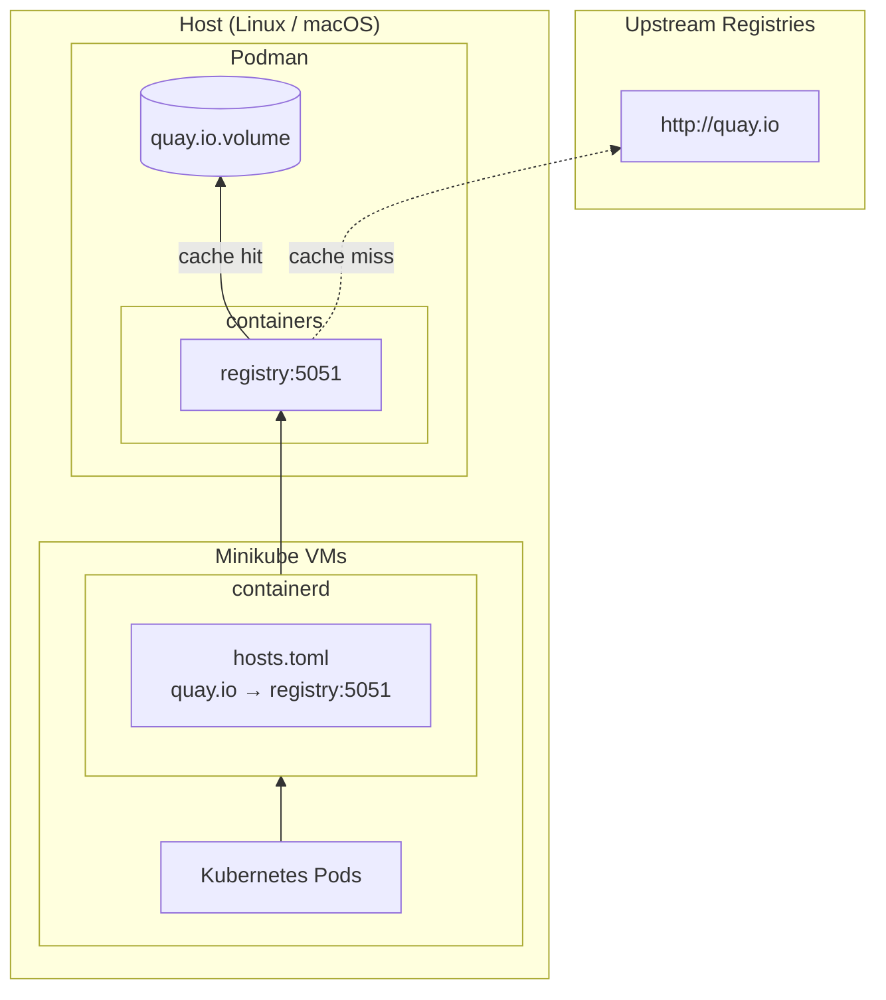
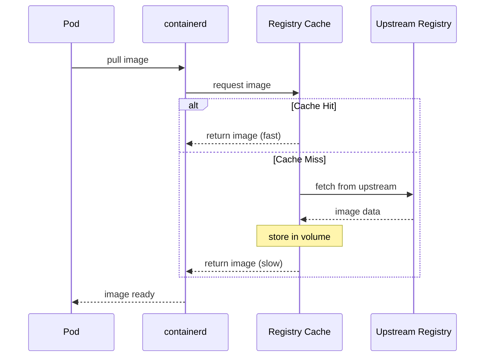

<!--
SPDX-FileCopyrightText: The RamenDR authors
SPDX-License-Identifier: Apache-2.0
-->

# Registry cache for minikube clusters

The registry cache provides pull-through caching for upstream container
registries. This speeds up image pulls and reduces network traffic.

The cache is managed automatically by drenv:

- `drenv setup`: Creates or updates registry cache containers
- `drenv cleanup`: Keeps registry cache containers running

## Architecture


```mermaid
flowchart BT
    subgraph upstream["Upstream Registries"]
        http://quay.io
    end

    subgraph host["Host (Linux / macOS)"]
        subgraph podman["Podman"]
            subgraph containers
                registry:5051
            end
            volume[("quay.io.volume")]
            registry:5051 -->|"cache hit"| volume
            registry:5051 -.->|"cache miss"| http://quay.io
        end

        subgraph minikube["Minikube VMs"]
            subgraph containerd["containerd"]
                config["hosts.toml<br/>quay.io → registry:5051"]
            end
            pods["Kubernetes Pods"]
            pods --> containerd
            containerd --> registry:5051
        end
    end
```

### Pull flow


```mermaid
sequenceDiagram
    participant Pod
    participant containerd
    participant Cache as Registry Cache
    participant Upstream as Upstream Registry

    Pod->>containerd: pull image
    containerd->>Cache: request image

    alt Cache Hit
        Cache-->>containerd: return image (fast)
    else Cache Miss
        Cache->>Upstream: fetch from upstream
        Upstream-->>Cache: image data
        Note over Cache: store in volume
        Cache-->>containerd: return image (slow)
    end

    containerd-->>Pod: image ready
```

## Port assignments

| Port | Upstream Registry |
|------|-------------------|
| 5051 | quay.io |
| 5052 | docker.io |
| 5053 | registry.k8s.io |
| 5054 | ghcr.io |
| 5055 | gcr.io |

## Container lifecycle

### Setup

During `drenv setup`, each registry cache container is checked:

1. If the container is not running, it is created
1. If the container is running with the current configuration, it is kept
1. If the container is running with outdated configuration, it is recreated

Configuration changes are detected using a hash of the container command line
stored as a label (`drenv.config`). This ensures containers are recreated when
the image, environment variables, or other settings change.

To check the current configuration hash:

```
podman inspect drenv-cache-quay-io --format '{{.Config.Labels.DrenvConfig}}'
```

### Cleanup

During `drenv cleanup`, registry cache containers are **not** removed. They
persist across environment runs to maintain the in-memory metadata cache,
which significantly improves performance.

To manually remove all registry cache containers:

```
podman rm --force $(podman ps -aq --filter name=drenv-cache)
```

Note: This only removes containers. Cached data in volumes is preserved and
will be used when containers are recreated.

## Initial setup - Linux

Allow access to registry cache ports in the libvirt zone:

```
sudo cp linux/registry-cache.xml /etc/firewalld/services/
sudo firewall-cmd --reload
sudo firewall-cmd --zone=libvirt --add-service=registry-cache --permanent
sudo firewall-cmd --reload
```

This allows minikube VMs to access the pull-through cache containers
running on the host.

## Initial setup - macOS

Allow podman to accept incoming connections:

```
version="$(podman version --format '{{.Version}}')"
gvproxy="/opt/homebrew/Cellar/podman/$version/libexec/podman/gvproxy"
sudo /usr/libexec/ApplicationFirewall/socketfilterfw --add "$gvproxy"
sudo /usr/libexec/ApplicationFirewall/socketfilterfw --unblock "$gvproxy"
```

This allows minikube VMs to access all podman published ports, including
the registry cache.

## Managing the cache

To check if the cache containers are running:

```
podman ps --filter name=drenv-cache
```

To view cached images for a specific registry (e.g., quay.io on port 5051):

```
curl -s http://localhost:5051/v2/_catalog | jq
```

To view cache logs:

```
podman logs drenv-cache-quay-io
```

## Cache storage

Cached data is stored in podman volumes named `drenv-cache-*`:

```
podman volume ls --filter name=drenv-cache
```

To remove all cached data (containers and volumes):

```
podman rm --force $(podman ps -aq --filter name=drenv-cache)
podman volume rm $(podman volume ls -q --filter name=drenv-cache)
```

## Cache metrics

Each registry cache exposes Prometheus metrics on an internal debug port
to check the cache hit rate.

To view cache hit/miss counts for a specific registry (e.g., quay.io):

```
podman exec drenv-cache-quay-io wget -qO- http://localhost:5001/metrics 2>/dev/null | grep registry_storage_cache
```

Example output:

```
registry_storage_cache_total{type="Hit"} 2052
registry_storage_cache_total{type="Miss"} 454
registry_storage_cache_total{type="Request"} 2506
```

To check all registries at once:

```
test/registry-cache/cache-stats
```

Example output:

```
| Registry | Hit | Miss | Request | Hit % |
|----------|-----|------|---------|-------|
| quay-io | 2276 | 505 | 2781 | 81% |
| docker-io | 122 | 40 | 162 | 75% |
| registry-k8s-io | 236 | 59 | 295 | 80% |
| ghcr-io | 45 | 24 | 69 | 65% |
| gcr-io | 0 | 0 | 0 | 0% |
```
