<!--
SPDX-FileCopyrightText: The RamenDR authors
SPDX-License-Identifier: Apache-2.0
-->

# Registry cache for minikube clusters

The registry cache provides pull-through caching for upstream container
registries. This speeds up image pulls and reduces network traffic.

> [!TIP]
> See [Initial setup - Linux](#initial-setup---linux) or
> [Initial setup - macOS](#initial-setup---macos) for first-time configuration.

## Architecture

```mermaid
flowchart BT
    subgraph upstream["Upstream Registries"]
        http://quay.io
    end

    subgraph host["Host (Linux / macOS)"]
        subgraph podman["Podman"]
            subgraph containers
                registry:5051
            end
            volume[("quay.io.volume")]
            registry:5051 -->|"cache hit"| volume
            registry:5051 -.->|"cache miss"| http://quay.io
        end

        subgraph minikube["Minikube VMs"]
            subgraph containerd["containerd"]
                config["hosts.toml<br/>quay.io → registry:5051"]
            end
            pods["Kubernetes Pods"]
            pods --> containerd
            containerd --> registry:5051
        end
    end
```



### Pull flow


## Port assignments

| Port | Upstream Registry |
|------|-------------------|
| 5051 | quay.io |
| 5052 | docker.io |
| 5053 | registry.k8s.io |
| 5054 | ghcr.io |
| 5055 | gcr.io |

## Lifecycle

Cache containers are created by `drenv setup` and kept running across
`drenv cleanup` and `drenv setup` cycles. This preserves the in-memory
metadata cache, which provides near 100% hit rate after the first run.

- `drenv setup`: Creates cache containers if they don't exist, or
  recreates them if the configuration has changed. Running containers
  with current configuration are not touched.
- `drenv cleanup`: Keeps cache containers running. Previously cleanup
  removed the containers, discarding the in-memory cache and causing
  hundreds of unnecessary cache misses on the next start.
- `drenv registry-cache remove`: Removes cache containers manually.
  Useful for development and testing of the registry cache.

## Initial setup - Linux

Allow access to registry cache ports in the libvirt zone:

```
sudo cp linux/registry-cache.xml /etc/firewalld/services/
sudo firewall-cmd --reload
sudo firewall-cmd --zone=libvirt --add-service=registry-cache --permanent
sudo firewall-cmd --reload
```

This allows minikube VMs to access the pull-through cache containers
running on the host.

## Initial setup - macOS

Allow podman to accept incoming connections:

```
version="$(podman version --format '{{.Version}}')"
gvproxy="/opt/homebrew/Cellar/podman/$version/libexec/podman/gvproxy"
sudo /usr/libexec/ApplicationFirewall/socketfilterfw --add "$gvproxy"
sudo /usr/libexec/ApplicationFirewall/socketfilterfw --unblock "$gvproxy"
```

This allows minikube VMs to access all podman published ports, including
the registry cache.

## Managing the cache

### Cache statistics

To view cache hit/miss statistics:

```
drenv registry-cache stats
```

Example output:

```json
[
  {
    "registry": "quay.io",
    "hits": 2242,
    "misses": 564,
    "errors": 0,
    "hit_rate": 79
  },
  ...
]
```

To get hit rates per registry:

```
drenv registry-cache stats | jq 'map({(.registry): .hit_rate}) | add'
```

```json
{
  "quay.io": 79,
  "docker.io": 73,
  "registry.k8s.io": 70,
  "ghcr.io": 64,
  "gcr.io": 0
}
```

To get the output as a markdown table:

```
drenv registry-cache stats -o markdown
```

Example output:

```
| Registry | Hits | Misses | Errors | Hit % |
|----------|------|--------|--------|-------|
| quay.io | 2242 | 564 | 0 | 79% |
| docker.io | 122 | 44 | 0 | 73% |
| registry.k8s.io | 299 | 124 | 0 | 70% |
| ghcr.io | 47 | 26 | 0 | 64% |
| gcr.io | 0 | 0 | 0 | 0% |
```

The metrics are:

- **hits**: cache lookups that returned a cached result
- **misses**: cache lookups where the item was not cached (fetched
  from upstream)
- **errors**: unexpected cache failures (not normal misses)
- **hit_rate**: percentage of requests served from cache

### Removing containers

To remove all cache containers:

```
drenv registry-cache remove
```

Cache containers are kept running across `drenv cleanup` cycles to
preserve the in-memory metadata cache. This command is useful for
development and testing of the registry cache.

### Checking containers

To check if the cache containers are running:

```
podman ps --filter name=drenv-cache
```

### Viewing cached images

To view cached images for a specific registry (e.g., quay.io on port 5051):

```
curl -s http://localhost:5051/v2/_catalog | jq
```

### Viewing logs

To view cache logs:

```
podman logs drenv-cache-quay-io
```

## Cache storage

Cached data is stored in podman volumes named `drenv-cache-*`:

```
podman volume ls --filter name=drenv-cache
```

To remove all cached data:

```
drenv registry-cache remove
podman volume rm $(podman volume ls -q --filter name=drenv-cache)
```
