<!--
SPDX-FileCopyrightText: The RamenDR authors
SPDX-License-Identifier: Apache-2.0
-->

# Registry cache for minikube clusters

The registry cache provides pull-through caching for upstream container
registries. This speeds up image pulls and reduces network traffic.

The cache is managed automatically by drenv:

- `drenv setup`: Creates and starts registry cache containers
- `drenv cleanup`: Stops and removes registry cache containers

## Architecture

```mermaid
flowchart BT
    subgraph upstream["Upstream Registries"]
        http://quay.io
    end

    subgraph host["Host (Linux / macOS)"]
        subgraph podman["Podman"]
            subgraph containers
                registry:5051
            end
            volume[("quay.io.volume")]
            registry:5051 -->|"cache hit"| volume
            registry:5051 -.->|"cache miss"| http://quay.io
        end

        subgraph minikube["Minikube VMs"]
            subgraph containerd["containerd"]
                config["hosts.toml<br/>quay.io → registry:5051"]
            end
            pods["Kubernetes Pods"]
            pods --> containerd
            containerd --> registry:5051
        end
    end
```



### Pull flow


## Port assignments

| Port | Upstream Registry |
|------|-------------------|
| 5051 | quay.io |
| 5052 | docker.io |
| 5053 | registry.k8s.io |
| 5054 | ghcr.io |
| 5055 | gcr.io |

## Initial setup - Linux

Allow access to registry cache ports in the libvirt zone:

```
sudo cp linux/registry-cache.xml /etc/firewalld/services/
sudo firewall-cmd --reload
sudo firewall-cmd --zone=libvirt --add-service=registry-cache --permanent
sudo firewall-cmd --reload
```

This allows minikube VMs to access the pull-through cache containers
running on the host.

## Initial setup - macOS

Allow podman to accept incoming connections:

```
version="$(podman version --format '{{.Version}}')"
gvproxy="/opt/homebrew/Cellar/podman/$version/libexec/podman/gvproxy"
sudo /usr/libexec/ApplicationFirewall/socketfilterfw --add "$gvproxy"
sudo /usr/libexec/ApplicationFirewall/socketfilterfw --unblock "$gvproxy"
```

This allows minikube VMs to access all podman published ports, including
the registry cache.

## Managing the cache

To check if the cache containers are running:

```
podman ps --filter name=drenv-cache
```

To view cached images for a specific registry (e.g., quay.io on port 5051):

```
curl -s http://localhost:5051/v2/_catalog | jq
```

To view cache logs:

```
podman logs drenv-cache-quay-io
```

## Cache storage

Cached data is stored in podman volumes named `drenv-cache-*`:

```
podman volume ls --filter name=drenv-cache
```

To remove all cached data:

```
drenv cleanup <envfile>
podman volume rm $(podman volume ls -q --filter name=drenv-cache)
```
