# System Metrics

## System

### CPU Usage

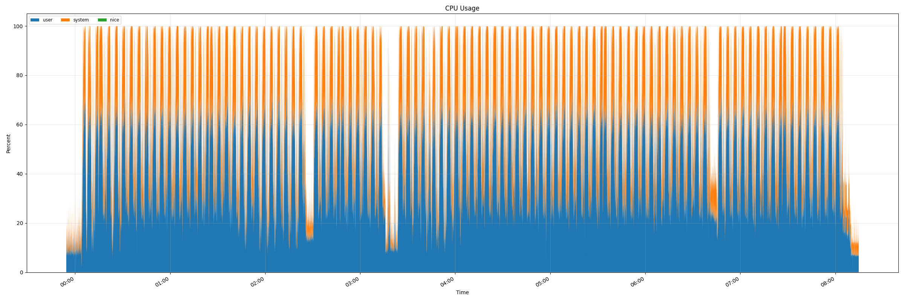

### Disk I/O

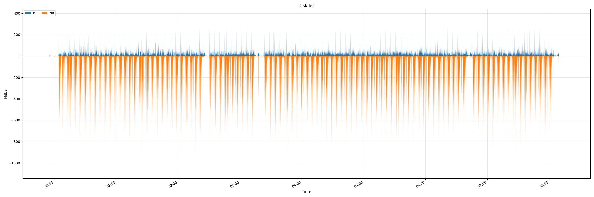

### System Load

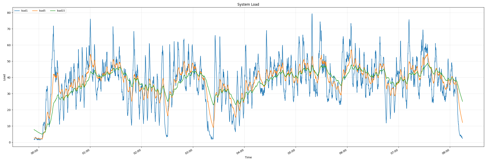

### Memory Usage

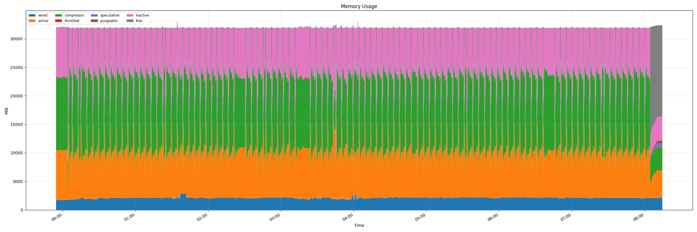

## Memory Details

### Page Faults

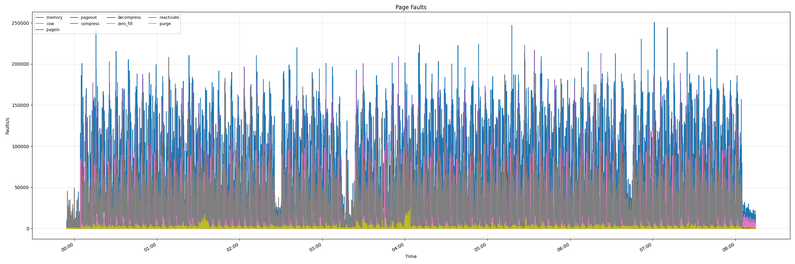

### Swap Usage

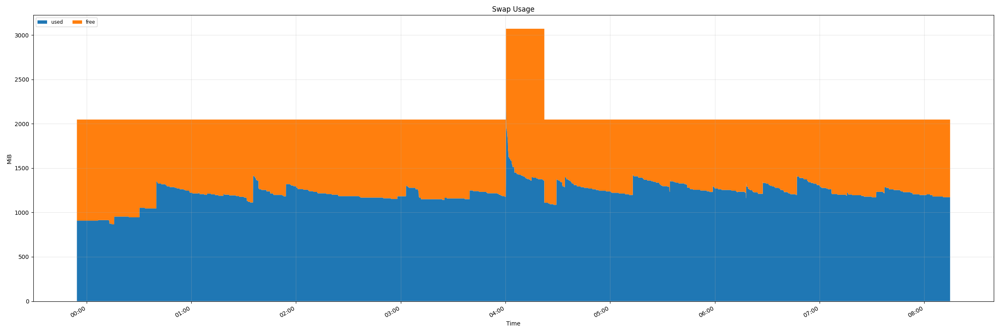

## Disk

### Disk I/O (disk0)

## Network

### Network en0

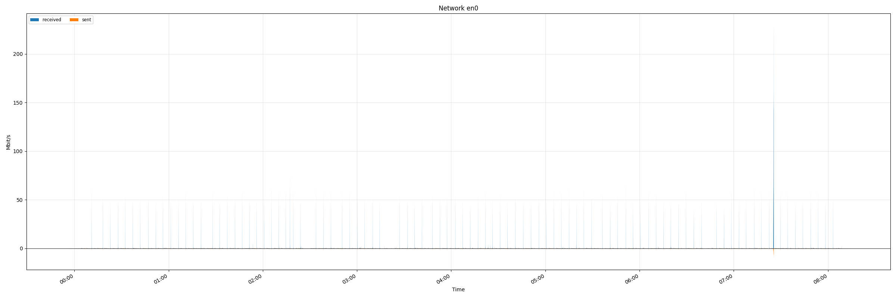

### Network en1

### Network en2

### Network en3

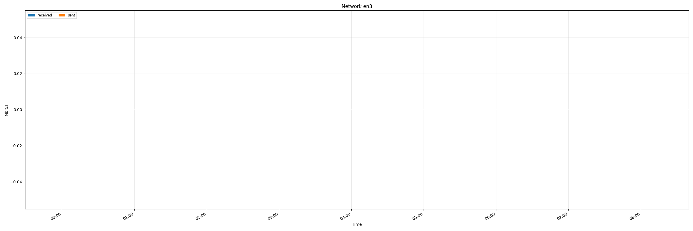

### Network en4

### Network en5

### Network en6

### Network stf0

### Network utun0

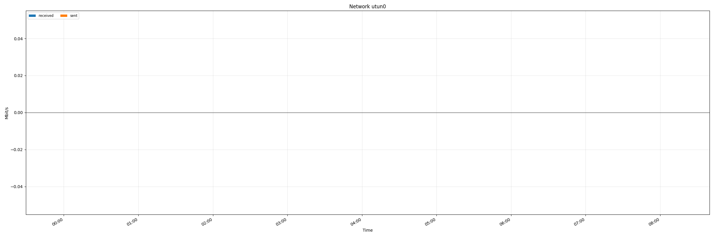

### Network utun1

### Network utun2

### Network utun3

### Network vmenet0

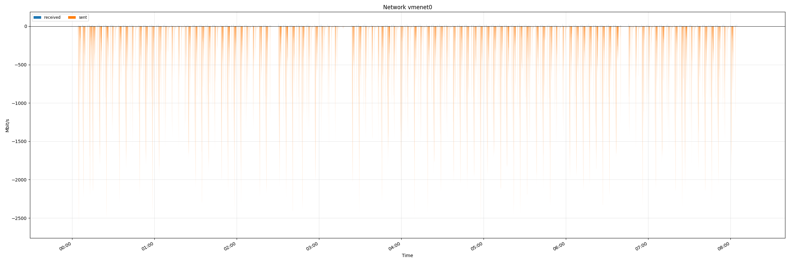

### Network vmenet1

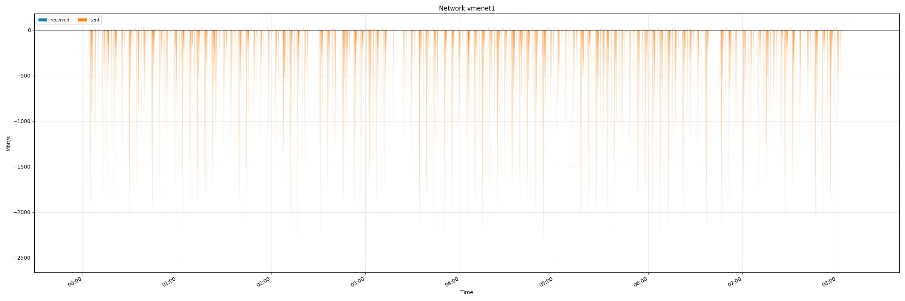

### Network vmenet2

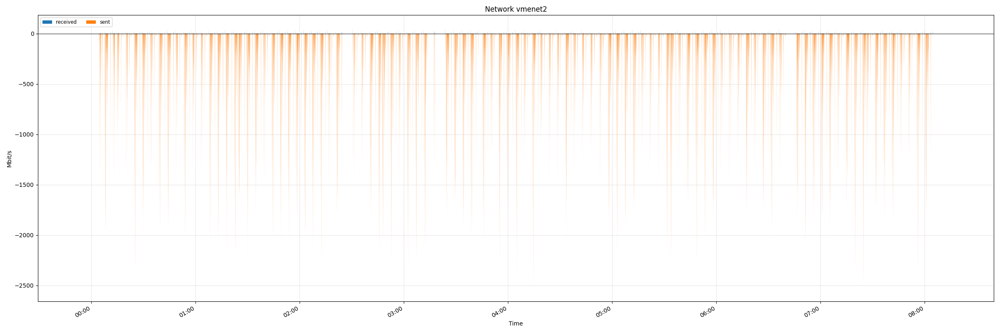
